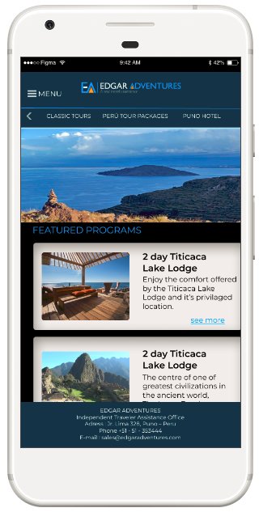
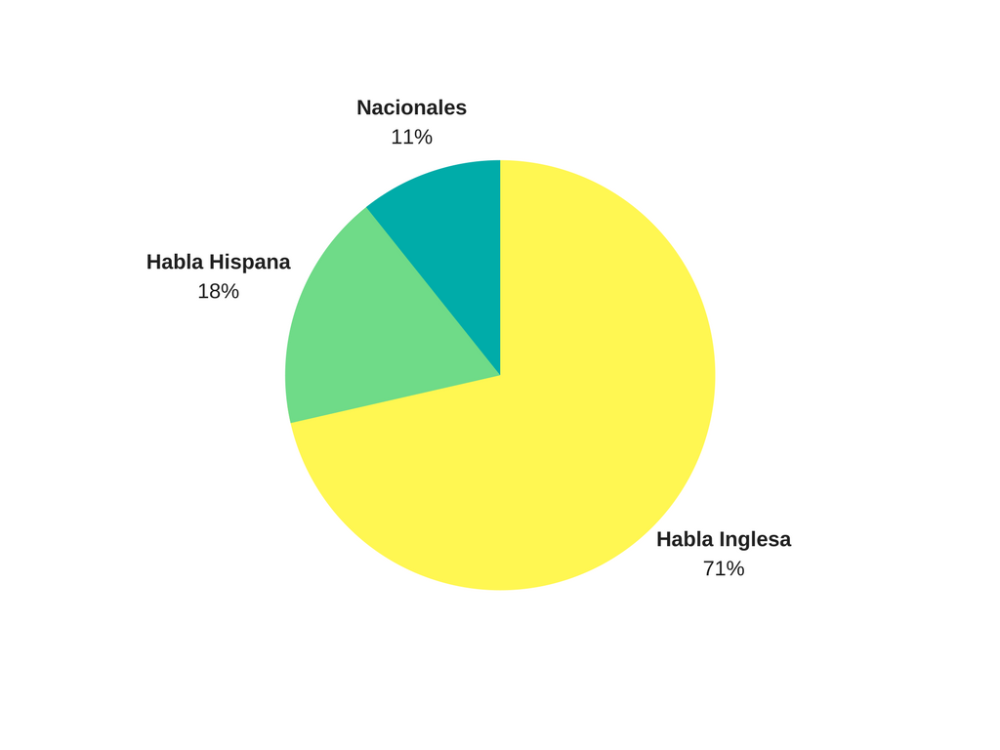
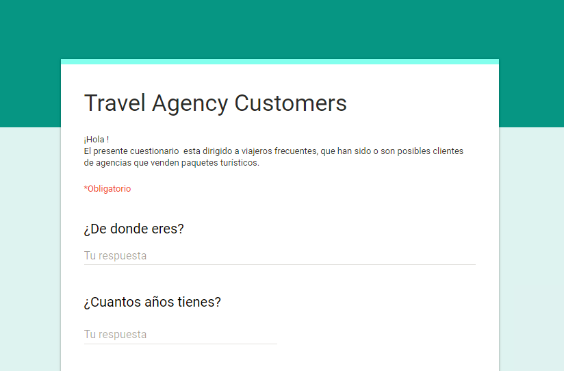
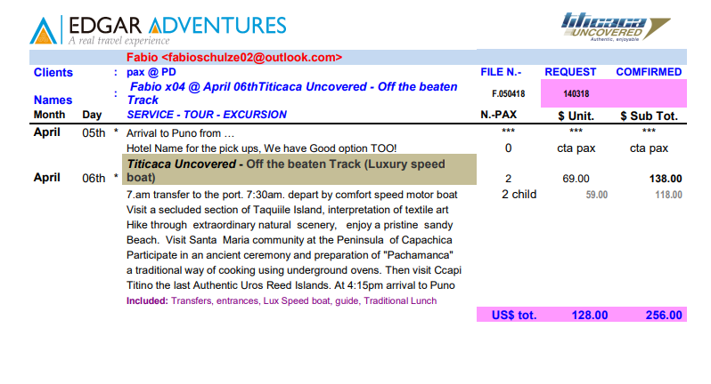
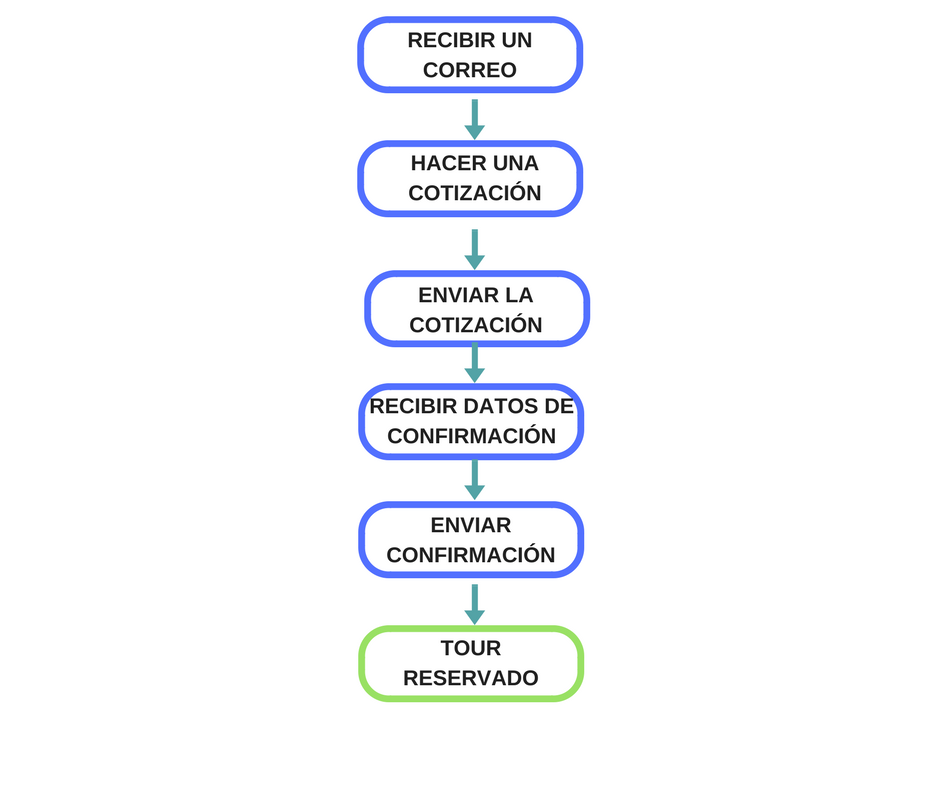
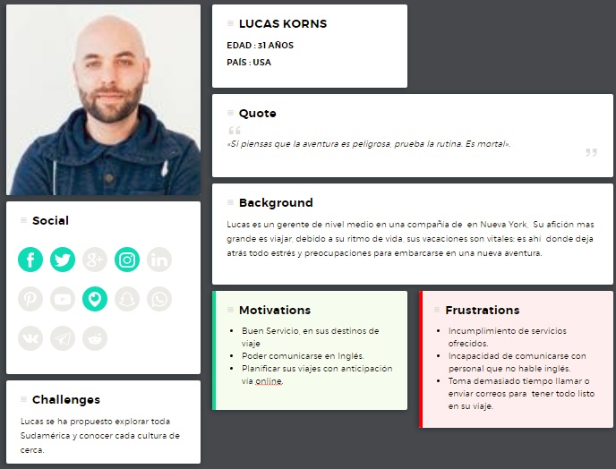

## Edgar Adventures Redesign

Propuesta de rediseño de la página web Edgar Adventures, agencia de viajes lider en el sur del Perú. 

## Desarrollado para

### **OBJETIVO**:
# Optimizando el proceso de compra y reserva de paquetes turisticos

### 1.- ETAPA DE DESCUBRIMIENTO

### 1.1 Entrevistas a Usuarios

Teniendo en cuenta el siguiente gráfico: 

Podemos observar que el 71% de clientes de la agencia son extranjeros de habla inglesa (Europa,EE.UU,etc.)

Es así que en busca de nuestro target, realizamos varias entrevistas a extranjeros preguntandole sobre sus preferencias a la hora de comprar un paquete turistico.

También realizamos una encuesta online para cubrir a todos nuestros posibles usuarios.

[Encuesta aquí](https://goo.gl/forms/w2irgA6j4AURcMVN2)

### 1.1 Entrevistas a Stakeholders

Como bien sabemos, este es un proceso de rediseño, por eso consideramos como  principales stakaholders al personal de la agencia.

Es así que pudimos obtener información de su proceso de reservas y cotizaciones.

Ejemplo:

Proceso actual:

### 2.- ETAPA DE IDEACIÓN

### 2.1 User Persona

